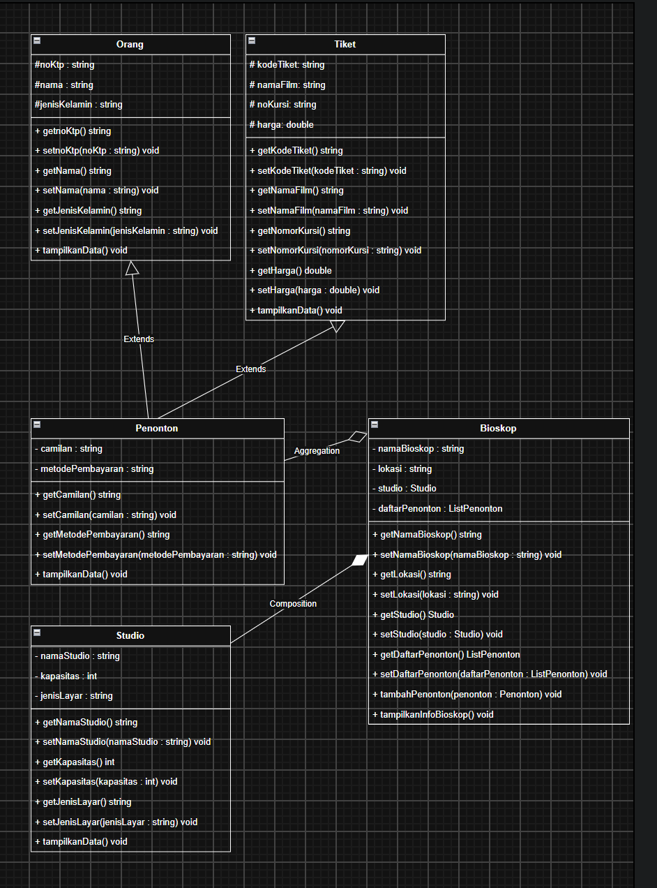

# Tugas Praktikum 3 DPBO 2526 C2 (TP3DPBO2526C2)
Sistem Informasi Manajemen Penonton Bioskop dengan Multiple Inheritance, Composition, dan Array of Object dalam C++ dan Python.

---

## Janji

> Saya Muhammad Zidan Mirza Fedrieka dengan NIM 2507692 mengerjakan Tugas Praktikum 3 dalam mata kuliah Desain Pemrograman Berorientasi Objek untuk keberkahan-Nya maka saya tidak melakukan kecurangan seperti yang telah dispesifikasikan. Aamiin.

---

## Penjelasan Desain dan Kode (Flow Kode)

### 1. Desain Class dan Relasi (Diagram Program)

Program menggunakan lima class dengan hubungan pewarisan majemuk (*Multiple Inheritance*), hubungan bagian-dari (*Composition*), dan penampung objek jamak (*Array of Object*):

#### Keterangan Simbol Diagram:
- **`+` (Public):** Anggota kelas dapat diakses dari luar kelas (seluruh *method*, *getter*, dan *setter*).
- **`-` (Private):** Anggota kelas hanya dapat diakses di dalam kelasnya sendiri (atribut kelas `Penonton`, `Studio`, `Bioskop`).
- **`#` (Protected):** Anggota kelas dapat diakses oleh kelas itu sendiri dan kelas turunannya (atribut kelas induk `Orang` dan `Tiket`).

---

### 2. Penjelasan Atribut dan Method Setiap Kelas

#### Class `Orang`
Class dasar pertama yang menyimpan identitas personal individu/penonton.

**Atribut:**
- `noKtp` (`string`): Nomor KTP atau identitas unik kependudukan penonton.
- `nama` (`string`): Nama lengkap orang.
- `jenisKelamin` (`string`): Jenis kelamin orang.

**Method:**
- `Orang()`: Konstruktor default untuk inisialisasi awal nilai kosong.
- `Orang(noKtp, nama, jenisKelamin)`: Konstruktor berparameter untuk mengisi nilai awal atribut.
- `getNoKtp()`: Mengembalikan nilai `noKtp`.
- `setNoKtp(noKtp)`: Mengubah nilai `noKtp`.
- `getNama()`: Mengembalikan nilai `nama`.
- `setNama(nama)`: Mengubah nilai `nama`.
- `getJenisKelamin()`: Mengembalikan nilai `jenisKelamin`.
- `setJenisKelamin(jenisKelamin)`: Mengubah nilai `jenisKelamin`.
- `tampilkanData()`: Menampilkan data dasar orang.

---

#### Class `Tiket`
Class dasar kedua yang menyimpan informasi tiket nonton bioskop.

**Atribut:**
- `kodeTiket` (`string`): Kode unik transaksi tiket.
- `namaFilm` (`string`): Judul film yang ditonton.
- `nomorKursi` (`string`): Nomor bangku kursi di studio.
- `harga` (`double`): Harga tiket dalam rupiah.

**Method:**
- `Tiket()`: Konstruktor default untuk inisialisasi awal nilai kosong.
- `Tiket(kodeTiket, namaFilm, nomorKursi, harga)`: Konstruktor berparameter untuk mengisi nilai awal tiket.
- `getKodeTiket()`: Mengembalikan nilai `kodeTiket`.
- `setKodeTiket(kodeTiket)`: Mengubah nilai `kodeTiket`.
- `getNamaFilm()`: Mengembalikan nilai `namaFilm`.
- `setNamaFilm(namaFilm)`: Mengubah nilai `namaFilm`.
- `getNomorKursi()`: Mengembalikan nilai `nomorKursi`.
- `setNomorKursi(nomorKursi)`: Mengubah nilai `nomorKursi`.
- `getHarga()`: Mengembalikan nilai `harga` tiket.
- `setHarga(harga)`: Mengubah nilai `harga` tiket.
- `tampilkanData()`: Menampilkan rincian data tiket.

---

#### Class `Penonton extends Orang, Tiket`
Class turunan yang menerapkan konsep **Multiple Inheritance** dengan mewarisi sifat dari class `Orang` dan class `Tiket` secara bersamaan.

**Atribut:**
- `camilan` (`string`): Pilihan makanan ringan/minuman yang dipesan penonton.
- `metodePembayaran` (`string`): Cara pembayaran yang digunakan (misal: QRIS, Debit, Tunai).

**Method:**
- `Penonton()`: Konstruktor default.
- `Penonton(...)`: Konstruktor berparameter lengkap yang meneruskan nilai ke konstruktor `Orang` dan `Tiket`.
- `getCamilan()`: Mengembalikan nilai `camilan`.
- `setCamilan(camilan)`: Mengubah nilai `camilan`.
- `getMetodePembayaran()`: Mengembalikan nilai `metodePembayaran`.
- `setMetodePembayaran(metodePembayaran)`: Mengubah nilai `metodePembayaran`.
- `tampilkanData()`: Menampilkan seluruh data penonton secara komprehensif.

---

#### Class `Studio`
Class komponen yang merepresentasikan ruangan studio bioskop. Objek ini menjadi bagian dari `Bioskop` melalui hubungan *Composition*.

**Atribut:**
- `namaStudio` (`string`): Nama atau nomor studio.
- `kapasitas` (`int`): Jumlah kapasitas kursi studio.
- `jenisLayar` (`string`): Tipe layar (misal: IMAX Laser, Regular 2D, Velvet).

**Method:**
- `Studio()`: Konstruktor default.
- `Studio(namaStudio, kapasitas, jenisLayar)`: Konstruktor berparameter.
- `getNamaStudio()`: Mengembalikan nilai `namaStudio`.
- `setNamaStudio(namaStudio)`: Mengubah nilai `namaStudio`.
- `getKapasitas()`: Mengembalikan nilai `kapasitas`.
- `setKapasitas(kapasitas)`: Mengubah nilai `kapasitas`.
- `getJenisLayar()`: Mengembalikan nilai `jenisLayar`.
- `setJenisLayar(jenisLayar)`: Mengubah nilai `jenisLayar`.
- `tampilkanData()`: Menampilkan informasi ruangan studio.

---

#### Class `Bioskop`
Class utama pengelola bioskop yang menerapkan konsep **Composition** (memiliki `Studio`) dan **Array of Object** (memiliki daftar `Penonton`).

**Atribut:**
- `namaBioskop` (`string`): Nama bioskop (misal: CGV Grand Indonesia).
- `lokasi` (`string`): Lokasi atau cabang bioskop.
- `studio` (`Studio`): Objek studio bioskop (*Composition*).
- `daftarPenonton` (`vector<Penonton>` / `list`): Penampung objek-objek penonton (*Array of Object*).

**Method:**
- `Bioskop()`: Konstruktor default.
- `Bioskop(namaBioskop, lokasi, namaStudio, kapasitas, jenisLayar)`: Konstruktor berparameter yang secara langsung membuat objek `Studio` di dalamnya (*Composition*).
- `getNamaBioskop()` / `setNamaBioskop()`: Getter dan setter nama bioskop.
- `getLokasi()` / `setLokasi()`: Getter dan setter lokasi.
- `getStudio()` / `setStudio()`: Getter dan setter objek studio.
- `getDaftarPenonton()` / `setDaftarPenonton()`: Getter dan setter penampung data penonton.
- `tambahPenonton(penonton)`: Menambahkan objek `Penonton` baru ke dalam array penonton.
- `tampilkanInfoBioskop()`: Menampilkan data bioskop dan data studionya.

---

### 3. Penjelasan Desain Konsep OOP

1. **Multiple Inheritance**:
   - Diterapkan pada class `Penonton` yang mengambil sifat identitas personal dari `Orang` dan sifat tiket bioskop dari `Tiket`.
   - Pada C++ dan Python, fitur pewarisan majemuk (*Multiple Inheritance*) ini didukung secara *native* langsung dari bahasa (`class Penonton : public Orang, public Tiket` pada C++ dan `class Penonton(Orang, Tiket)` pada Python).

2. **Composition (Komposisi)**:
   - Diterapkan antara class `Bioskop` dan `Studio`. Objek `Studio` diciptakan secara langsung di dalam konstruktor class `Bioskop` (*tightly coupled*), yang berarti keberadaan `Studio` merupakan bagian utuh dari siklus hidup objek `Bioskop`.

3. **Array of Object**:
   - Diterapkan pada class `Bioskop` yang menampung kumpulan objek `Penonton` dalam struktur data dinamis (`vector` di C++ dan `list` di Python).

4. **Encapsulation (Getter dan Setter)**:
   - Seluruh atribut pada setiap kelas dilindungi dengan *access modifier* (`private` atau `protected`) dan disediakan *getter* serta *setter* lengkap sesuai konvensi standar OOP.

---

### 4. Penjelasan Alur Program

1. Program memulai eksekusi pada fungsi utama (`main`).
2. Objek `Bioskop` dibuat dengan nama, lokasi, serta spesifikasi studio (nama studio, kapasitas, dan jenis layar), yang secara otomatis menginstansiasi objek `Studio` di dalamnya.
3. Program mencetak **Data Sebelum Penambahan Penonton**, yang memperlihatkan informasi bioskop/studio dan status tabel penonton yang masih kosong.
4. Tiga objek penonton awal dibuat dan dimasukkan ke dalam daftar bioskop melalui method `tambahPenonton()`.
5. Dua objek penonton tambahan dibuat dan ditambahkan lagi untuk menunjukkan kemampuan penambahan data.
6. Program mencetak **Data Sesudah Penambahan Penonton**, yang menampilkan tabel rapi bergaris berisi seluruh penonton yang kini terdaftar.

---

## Dokumentasi Output Program

### 1. C++
*(Simpan screenshot running program C++ di folder `CPP/Dokumentasi`)*

### 2. Python
*(Simpan screenshot running program Python di folder `Python/Dokumentasi`)*
