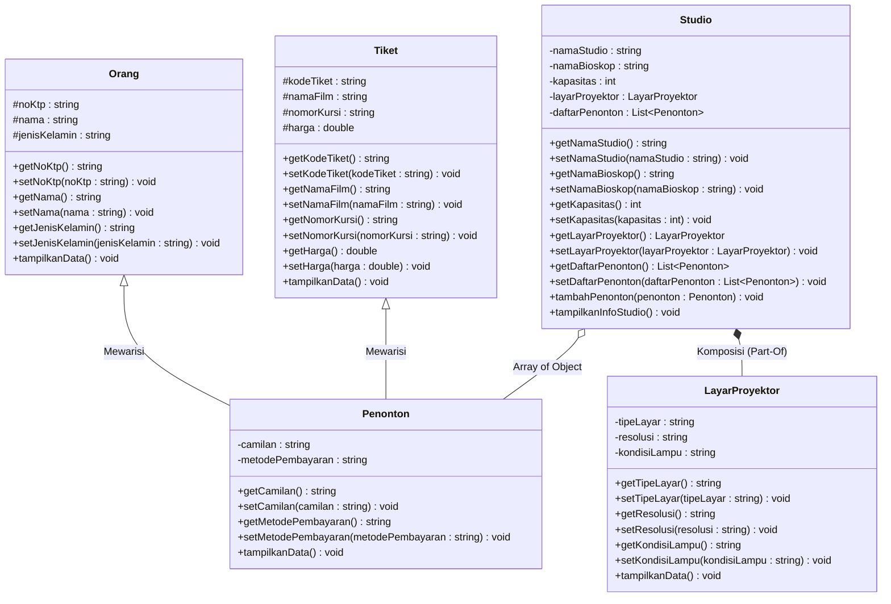

# Tugas Praktikum 3 DPBO 2526 C2 (TP3DPBO2526C2)
Sistem Informasi Manajemen Penonton Bioskop dengan Multiple Inheritance, Composition, dan Array of Object dalam C++ dan Python.

---

## Janji

> Saya Muhammad Zidan Mirza Fedrieka dengan NIM 2507692 mengerjakan Tugas Praktikum 3 dalam mata kuliah Desain Pemrograman Berorientasi Objek untuk keberkahan-Nya maka saya tidak melakukan kecurangan seperti yang telah dispesifikasikan. Aamiin.

---

## Penjelasan Desain dan Kode (Flow Kode)

### 1. Desain Class dan Relasi (Diagram Program)

Program dengan tema Bioskop, menggunakan lima class dengan hubungan pewarisan majemuk (*Multiple Inheritance*), hubungan bagian-dari (*Composition*), dan penampung objek jamak (*Array of Object*):

#### Keterangan Simbol Diagram:
- **`+` (Public):** Anggota kelas dapat diakses dari luar kelas (seluruh *method*, *getter*, dan *setter*).
- **`-` (Private):** Anggota kelas hanya dapat diakses di dalam kelasnya sendiri (atribut kelas `Penonton`, `LayarProyektor`, `Studio`).
- **`#` (Protected):** Anggota kelas dapat diakses oleh kelas itu sendiri dan kelas turunannya (atribut kelas induk `Orang` dan `Tiket`).

---

### 2. Penjelasan Atribut dan Method Setiap Kelas

#### Class `Orang`
Class dasar pertama yang menyimpan identitas personal individu/penonton.

**Atribut:**
- `noKtp` (`string`): Nomor KTP atau identitas unik kependudukan penonton.
- `nama` (`string`): Nama lengkap orang.
- `jenisKelamin` (`string`): Jenis kelamin orang.

**Method:**
- `Orang()`: Konstruktor default untuk inisialisasi awal nilai kosong.
- `Orang(noKtp, nama, jenisKelamin)`: Konstruktor berparameter untuk mengisi nilai awal atribut.
- `getNoKtp()`: Mengembalikan nilai `noKtp`.
- `setNoKtp(noKtp)`: Mengubah nilai `noKtp`.
- `getNama()`: Mengembalikan nilai `nama`.
- `setNama(nama)`: Mengubah nilai `nama`.
- `getJenisKelamin()`: Mengembalikan nilai `jenisKelamin`.
- `setJenisKelamin(jenisKelamin)`: Mengubah nilai `jenisKelamin`.
- `tampilkanData()`: Menampilkan data dasar orang.
- `~Orang()`: Destruktor untuk membersihkan objek `Orang` (C++).

---

#### Class `Tiket`
Class dasar kedua yang menyimpan informasi tiket nonton bioskop.

**Atribut:**
- `kodeTiket` (`string`): Kode unik transaksi tiket.
- `namaFilm` (`string`): Judul film yang ditonton.
- `nomorKursi` (`string`): Nomor bangku kursi di studio.
- `harga` (`double`): Harga tiket dalam rupiah.

**Method:**
- `Tiket()`: Konstruktor default untuk inisialisasi awal nilai kosong.
- `Tiket(kodeTiket, namaFilm, nomorKursi, harga)`: Konstruktor berparameter untuk mengisi nilai awal tiket.
- `getKodeTiket()`: Mengembalikan nilai `kodeTiket`.
- `setKodeTiket(kodeTiket)`: Mengubah nilai `kodeTiket`.
- `getNamaFilm()`: Mengembalikan nilai `namaFilm`.
- `setNamaFilm(namaFilm)`: Mengubah nilai `namaFilm`.
- `getNomorKursi()`: Mengembalikan nilai `nomorKursi`.
- `setNomorKursi(nomorKursi)`: Mengubah nilai `nomorKursi`.
- `getHarga()`: Mengembalikan nilai `harga` tiket.
- `setHarga(harga)`: Mengubah nilai `harga` tiket.
- `tampilkanData()`: Menampilkan rincian data tiket.
- `~Tiket()`: Destruktor untuk membersihkan objek `Tiket` (C++).

---

#### Class `Penonton extends Orang, Tiket`
Class turunan yang menerapkan konsep **Multiple Inheritance** dengan mewarisi sifat dari class `Orang` dan class `Tiket` secara bersamaan.

**Atribut:**
- `camilan` (`string`): Pilihan makanan ringan/minuman yang dipesan penonton.
- `metodePembayaran` (`string`): Cara pembayaran yang digunakan (misal: QRIS, Debit, Tunai).

**Method:**
- `Penonton()`: Konstruktor default.
- `Penonton(...)`: Konstruktor berparameter lengkap yang meneruskan nilai ke konstruktor `Orang` dan `Tiket`.
- `getCamilan()`: Mengembalikan nilai `camilan`.
- `setCamilan(camilan)`: Mengubah nilai `camilan`.
- `getMetodePembayaran()`: Mengembalikan nilai `metodePembayaran`.
- `setMetodePembayaran(metodePembayaran)`: Mengubah nilai `metodePembayaran`.
- `tampilkanData()`: Menampilkan seluruh data penonton secara komprehensif.
- `~Penonton()`: Destruktor untuk membersihkan objek `Penonton` (C++).

---

#### Class `LayarProyektor`
Class komponen yang merepresentasikan perangkat layar proyektor. Objek ini menjadi bagian dari `Studio` melalui hubungan *Composition*.

**Atribut:**
- `tipeLayar` (`string`): Jenis teknologi layar proyektor (misal: IMAX Laser).
- `resolusi` (`string`): Resolusi tayangan layar (misal: 4K Ultra HD).
- `kondisiLampu` (`string`): Status kondisi lampu proyektor (misal: Optimal).

**Method:**
- `LayarProyektor()`: Konstruktor default.
- `LayarProyektor(tipeLayar, resolusi, kondisiLampu)`: Konstruktor berparameter.
- `getTipeLayar()`: Mengembalikan nilai `tipeLayar`.
- `setTipeLayar(tipeLayar)`: Mengubah nilai `tipeLayar`.
- `getResolusi()`: Mengembalikan nilai `resolusi`.
- `setResolusi(resolusi)`: Mengubah nilai `resolusi`.
- `getKondisiLampu()`: Mengembalikan nilai `kondisiLampu`.
- `setKondisiLampu(kondisiLampu)`: Mengubah nilai `kondisiLampu`.
- `tampilkanData()`: Menampilkan spesifikasi layar proyektor.
- `~LayarProyektor()`: Destruktor untuk membersihkan objek `LayarProyektor` (C++).

---

#### Class `Studio`
Class utama pengelola studio yang menerapkan konsep **Composition** (memiliki `LayarProyektor`) dan **Array of Object** (memiliki daftar `Penonton`).

**Atribut:**
- `namaStudio` (`string`): Nama studio (misal: Studio 1 - Velvet Screen).
- `namaBioskop` (`string`): Nama bioskop tempat studio berada (misal: CGV Grand Indonesia).
- `kapasitas` (`int`): Jumlah kapasitas kursi di studio.
- `layarProyektor` (`LayarProyektor`): Objek proyektor (*Composition*).
- `daftarPenonton` (`vector<Penonton>` / `list`): Penampung objek-objek penonton (*Array of Object*).

**Method:**
- `Studio()`: Konstruktor default.
- `Studio(namaStudio, namaBioskop, kapasitas, tipeLayar, resolusi, kondisiLampu)`: Konstruktor berparameter yang secara langsung membuat objek `LayarProyektor` di dalamnya (*Composition*).
- `getNamaStudio()` / `setNamaStudio()`: Getter dan setter nama studio.
- `getNamaBioskop()` / `setNamaBioskop()`: Getter dan setter nama bioskop.
- `getKapasitas()` / `setKapasitas()`: Getter dan setter kapasitas kursi.
- `getLayarProyektor()` / `setLayarProyektor()`: Getter dan setter objek proyektor.
- `getDaftarPenonton()` / `setDaftarPenonton()`: Getter dan setter penampung data penonton.
- `tambahPenonton(penonton)`: Menambahkan objek `Penonton` baru ke dalam array penonton.
- `tampilkanInfoStudio()`: Menampilkan data umum studio dan spesifikasi layarnya.
- `~Studio()`: Destruktor untuk membersihkan objek `Studio` (C++).

---

### 3. Penjelasan Desain Konsep OOP

1. **Multiple Inheritance**:
   - Diterapkan pada class `Penonton` yang mengambil sifat identitas personal dari `Orang` dan sifat tiket bioskop dari `Tiket`.

2. **Composition (Komposisi)**:
   - Diterapkan antara class `Studio` dan `LayarProyektor`. Objek `LayarProyektor` diciptakan secara langsung di dalam konstruktor class `Studio` (*tightly coupled*), yang berarti keberadaan `LayarProyektor` merupakan bagian utuh dari siklus hidup objek `Studio`.

3. **Array of Object**:
   - Diterapkan pada class `Studio` yang menampung kumpulan objek `Penonton` dalam struktur data dinamis (`vector` di C++ dan `list` di Python).

4. **Encapsulation (Getter dan Setter)**:
   - Seluruh atribut pada setiap kelas dilindungi dengan *access modifier* (`private` atau `protected`) dan disediakan *getter* serta *setter* lengkap.

---

### 4. Penjelasan Alur Program

1. Program memulai eksekusi pada fungsi utama (`main`).
2. Objek `Studio` dibuat dengan nama studio, nama bioskop, kapasitas, serta spesifikasi layar proyektor (tipe layar, resolusi, kondisi lampu), yang secara otomatis menginstansiasi objek `LayarProyektor` di dalamnya (*Composition*).
3. Tiga objek penonton awal dibuat dan dimasukkan ke dalam daftar studio melalui method `tambahPenonton()`.
4. Program mencetak **Data Sebelum Penambahan Penonton**, yang memperlihatkan informasi studio/layar dan tabel bergaris berisi 3 data penonton awal.
5. Dua objek penonton baru dibuat dan ditambahkan ke dalam studio untuk mendemonstrasikan penambahan data dinamis (*Array of Object*).
6. Program mencetak **Data Sesudah Penambahan Penonton**, yang menampilkan tabel rapi bergaris berisi seluruh 5 data penonton yang kini terdaftar.

---

## Dokumentasi Output Program

### 1. C++

### 2. Python
